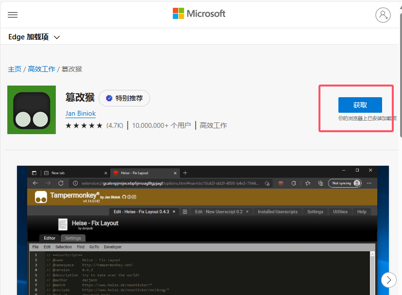
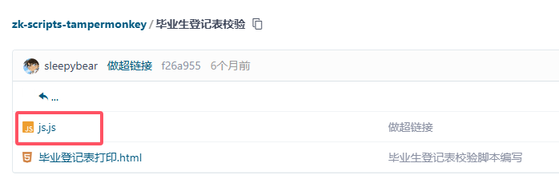
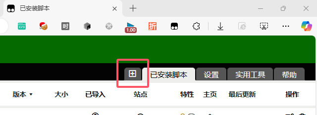
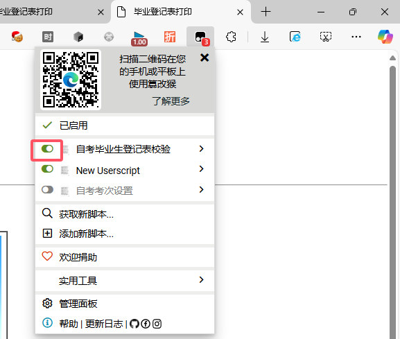

# 自考篡改猴脚本
这个脚本用于浙江自考的后台管理员，将一些功能进行了优化，方便使用，减少工作量。

# 如何使用
## 安装篡改猴脚本
1. 安装`篡改猴(也叫油猴)脚本`插件，推荐使用 Edge/Chrome 浏览器，下面使用 Edge 浏览器为例。
2. 插件的首页地址：[https://www.tampermonkey.net](https://www.tampermonkey.net/)
3. 在首页下滑页面，在“下载”栏找到“Tampermonkey”字样，下面有“去商店”按钮，点击进入商店。
4. 在商店页面点击“获取”按钮，然后点击“添加扩展”按钮，即可安装成功。
5. 在浏览器的上侧找到扩展按钮，点击即可看到`Tampermonkey`插件，点击进入插件的管理页面。
6. 可以点击插件右侧的类似眼睛的图标，即可将插件的图标显示在浏览器的上侧，方便使用。
7. 点击插件图标，点击“管理面板”按钮，进入插件的管理页面。
8. 在管理页面的“已安装脚本”页面可以看到已经安装的脚本。当需要修改或者更新的时候，随时可以点开某个脚本进行编辑。
9. 好了，至此，篡改猴脚本插件安装完成。

## 安装自考篡改猴脚本
1. 进入本仓库中的对应需要的功能的脚本的文件夹下。
2. 找到对应的`js.js`文件，复制。
3. 打开篡改猴的管理面板（方法见上面的步骤）。
4. 如果脚本已经在列表中了，那么直接点击脚本的名称即可进入编辑页面。
5. 如果脚本不在列表中，那么点击右上角“已安装脚本”左侧的“+”按钮，进入新建脚本页面。
6. 将复制的内容粘贴到编辑框中，然后保存(Ctrl+S)即可。
7. 保存后，可以在自考的后台的对应的页面刷新一下，在对应的页面上就可以看到脚本的效果了。
8. 如果不需要了，可以在篡改猴的管理页面中，左侧的开关按钮关闭脚本即可。